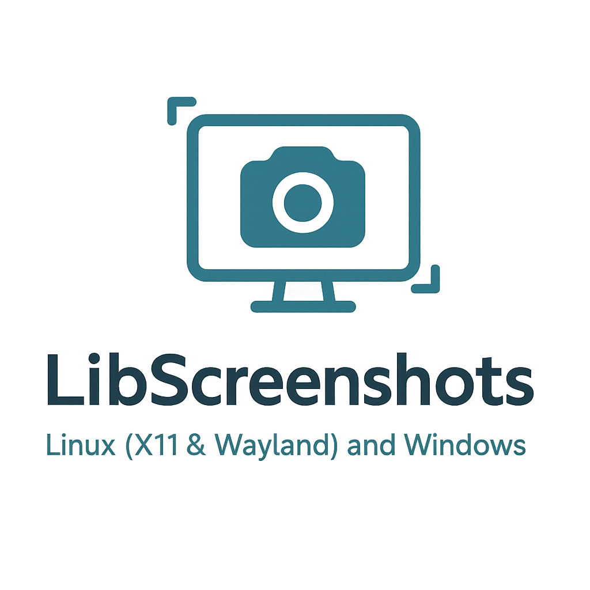

<div align="center">




[](https://opensource.org/licenses/MIT)
[](https://github.com/johnnymast/LibScreenshots/actions/workflows/build.yml)
</div>

## General

```bash
sudo pacman -S opencv-cuda cuda
```

## Wayland 

```bash
sudo pacman -S xdg-desktop-portal-hyprland
sudo pacman -S wayland wayland-protocols dbus dbus-glib glib2 libxkbcommon gtk3 xdg-desktop-portal xdg-desktop-portal-wlr pkgconf glib2

```

## PipeWire

```bash
sudo pacman -S pipewire libpipewire xdg-desktop-portal xdg-desktop-portal-gnome

```

## X11


```bash
sudo pacman -S libx11 
```